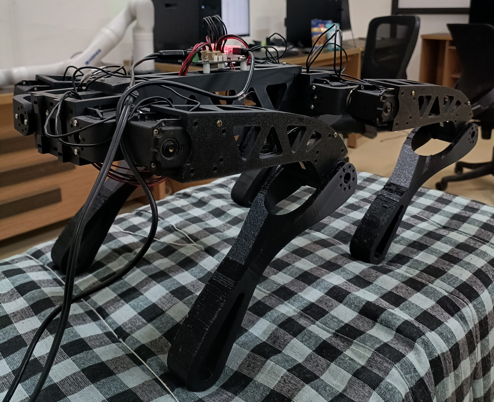

# Rumi - Open Source Quadruped Robot



## Overview

Rumi is an open-source quadruped robot project built with Dynamixel servo motors. This repository contains the control software and examples for operating the robot.

Rumi is designed to be an accessible platform for robotics research and education. The project uses ROBOTIS Dynamixel motors for precise control and provides Python-based interfaces for motor control and coordination.

## Getting Started

### Prerequisites

- Python 3.8 or higher
- USB to serial adapter (U2D2 or compatible)
- ROBOTIS Dynamixel motors (MX-64 or compatible)
- Linux/macOS/Windows operating system

### Installation

#### 1. Clone the Repository

```bash
git clone https://github.com/vishcomestrue/rumi-custom-quadruped.git rumi
cd rumi
```

#### 2. Set Up Python Environment

We recommend using `uv` for fast Python package management:

```bash
# Install uv if you haven't already
curl -LsSf https://astral.sh/uv/install.sh | sh

# Create a virtual environment
uv venv

# Activate the environment
source .venv/bin/activate  # On Linux/macOS
# or
.venv\Scripts\activate  # On Windows
```

#### 3. Install DynamixelSDK

Clone and install the DynamixelSDK Python package:

```bash
# Clone the DynamixelSDK repository
git clone https://github.com/ROBOTIS-GIT/DynamixelSDK.git

# Navigate to the Python directory and install
cd DynamixelSDK/python
uv pip install -e .
cd ../..
```

#### 4. Install Additional Dependencies

```bash
uv pip install -r requirements.txt  # If you have a requirements.txt file
```

## Usage

### Motor Testing

The `allmotortest` directory contains examples for controlling multiple Dynamixel motors:

```bash
cd allmotortest
python multi_motor_controller.py
```

See the [allmotortest README](./allmotortest/README.md) for more details on motor configuration and testing.

## Project Structure

```
rumi/
├── allmotortest/          # Multi-motor control examples
│   ├── multi_motor_controller.py
│   ├── mx_64.md           # MX-64 motor documentation
│   └── README.md
├── motortest/             # Motor testing and control utilities
│   ├── all_motor_control.py
│   ├── basic_sitstand.py
│   ├── mx64_controller.py
│   ├── test_motors.py
│   └── README.md
├── policy/                # Control policies (coming soon)
├── sim2real/              # Simulation to real transfer (coming soon)
└── README.md
```

## Hardware Setup

1. Connect your Dynamixel motors to the U2D2 adapter
2. Connect the U2D2 to your computer via USB
3. Ensure motors are properly powered (12V for MX series)
4. Configure motor IDs using the ROBOTIS Dynamixel Wizard if needed

## Contributing

Contributions are welcome! Please feel free to submit issues and pull requests.

## License

This project is open source. See the [COPYING](./COPYING) file for details.

## Acknowledgments

- Built using [ROBOTIS DynamixelSDK](https://github.com/ROBOTIS-GIT/DynamixelSDK)
- Inspired by the open-source robotics community

## Contact

For questions and support, please open an issue on GitHub.

---

*Note: This project is under active development. More features and documentation will be added over time.*
