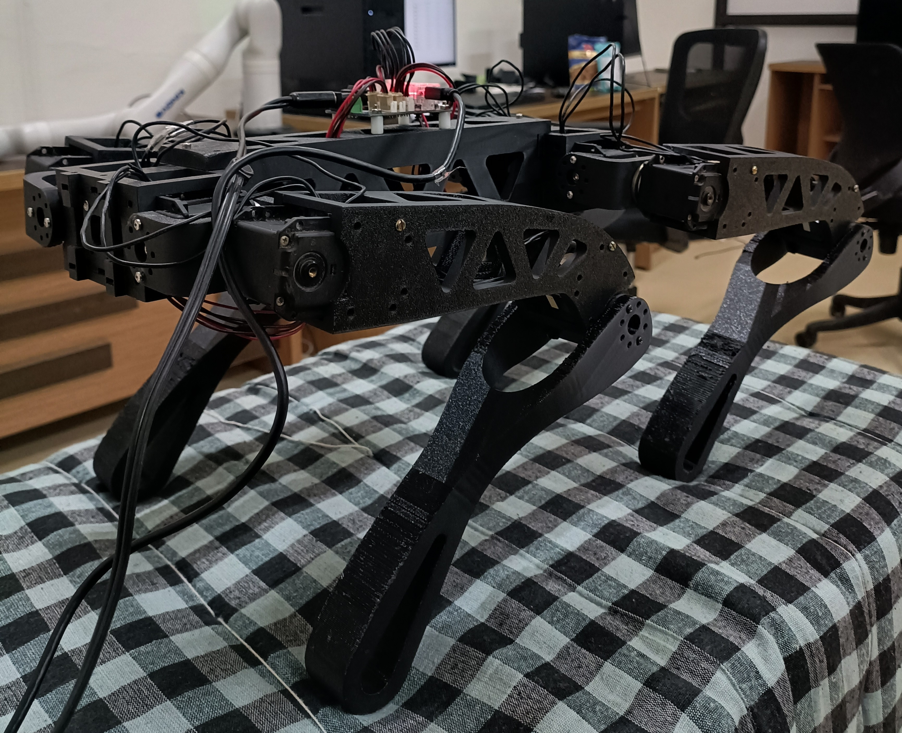

# Rumi - Open Source Quadruped Robot
[](https://www.gnu.org/licenses/gpl-3.0) [](https://docs.python.org/3/whatsnew/3.10.html) [](https://www.raspberrypi.com/) [](https://pytorch.org/) [](https://mujoco.org/) [](https://github.com/lsquarelabs)



## Overview

Rumi is an open-source quadruped robot built with 12 ROBOTIS Dynamixel MX-64 servo motors. This repository contains the full control stack: low-level motor drivers, hardware interfaces, system identification tools, and trained reinforcement learning policies for sim-to-real deployment.

The robot runs trained RL policies (getup, velocity tracking) directly on a Raspberry Pi at 50 Hz using a BNO080 IMU for orientation. Policies are trained in [mjlab](https://github.com/mujocolab/mjlab/) and transferred to real hardware without any simulation at runtime.

## Getting Started

### Prerequisites

- Raspberry Pi (primary deployment target)
- Python 3.10 or higher
- ROBOTIS Dynamixel MX-64 motors (×12)
- USB to serial adapter (U2D2 or compatible)
- BNO080 IMU (I2C, address `0x4b`)
- 12V DC power supply for motors

### Installation

#### 1. Clone the Repository

```bash
git clone https://github.com/vishcomestrue/rumi-open-source-quadruped.git rumi
cd rumi
```

#### 2. Set Up Python Environment

We recommend using `uv` for fast Python package management:

```bash
# Install uv if you haven't already
curl -LsSf https://astral.sh/uv/install.sh | sh

# Create a virtual environment
uv venv

# Activate the environment
source .venv/bin/activate
```

#### 3. Install DynamixelSDK

```bash
git clone https://github.com/ROBOTIS-GIT/DynamixelSDK.git
cd DynamixelSDK/python
uv pip install -e .
cd ../..
```

#### 4. Install Python Dependencies

**Policy deployment (getup + velocity):**

```bash
uv pip install "torch==2.11.0+cpu" --index-url https://download.pytorch.org/whl/cpu
uv pip install "numpy==2.2.6" "adafruit-circuitpython-bno08x==1.3.1" "adafruit-blinka==8.68.1"
```

**System identification and visualization:**

```bash
uv pip install "mujoco==3.7.0" "scipy==1.15.3" "matplotlib==3.10.8" "viser==1.0.24"
```

| Package | Version | Purpose |
|---------|---------|---------|
| `torch` (CPU) | 2.11.0 | Policy inference on Raspberry Pi |
| `numpy` | 2.2.6 | Observation math and kinematics |
| `adafruit-circuitpython-bno08x` | 1.3.1 | BNO080 IMU driver |
| `adafruit-blinka` | 8.68.1 | Provides `board` and `busio` for Raspberry Pi I2C |
| `dynamixel-sdk` | — | Dynamixel motor communication (installed via editable above) |
| `mujoco` | 3.7.0 | Physics simulation for system identification |
| `scipy` | 1.15.3 | Parameter fitting in sysid |
| `matplotlib` | 3.10.8 | Sysid analysis plots |
| `viser` | 1.0.24 | Real-time 3D IMU visualization |

## Hardware Setup

### Wiring

1. Connect the 12 Dynamixel motors to the U2D2 adapter via RS-485
2. Connect the U2D2 to the Raspberry Pi via USB (`/dev/ttyUSB0`)
3. Connect the BNO080 IMU to the Raspberry Pi I2C bus (SDA/SCL)
4. Power motors at 12V DC

### Enable I2C (for BNO080 IMU)

```bash
sudo raspi-config
# Interface Options → I2C → Enable
# Reboot after enabling
```

### USB Latency Timer (Critical for 50 Hz control)

The USB latency timer must be set to 1ms. Without this, the control loop cannot sustain 50 Hz.

**Automated setup (one-time, recommended):**

```bash
./setup_usb_latency.sh
```

The script detects your FTDI device, creates a udev rule, and installs it. The timer will be set to 1ms automatically on every plug-in, persisting across reboots.

**Manual setup (temporary, current session only):**

```bash
sudo sh -c 'echo 1 > /sys/bus/usb-serial/devices/ttyUSB0/latency_timer'
```

### Permissions

```bash
sudo usermod -a -G dialout $USER
# Log out and back in for this to take effect
```

### Motor Layout

```
                    FRONT
        ┌─────────────────────────┐
        │                         │
 FL     │      ┌───────────┐      │     FR
┌─────┐ │      │   BODY    │      │  ┌─────┐
│  1  │─┼──────┤           ├──────┼──│ 10  │
└──┬──┘ │      └───────────┘      │  └──┬──┘
   │  2 │                         │  11 │
   │  3 │                         │  12 │
        │                         │
 RL     │      ┌───────────┐      │     RR
┌─────┐ │      │   BODY    │      │  ┌─────┐
│  4  │─┼──────┤           ├──────┼──│  7  │
└──┬──┘ │      └───────────┘      │  └──┬──┘
   │  5 │                         │   8 │
   │  6 │                         │   9 │
        └─────────────────────────┘
                    REAR

FL = Front Left  (1, 2, 3)      FR = Front Right (10, 11, 12)
RL = Rear Left   (4, 5, 6)      RR = Rear Right  (7, 8, 9)
```

Each leg: `[hip] → [upper leg] → [lower leg]`

## Motor Testing

The `motortest/` and `allmotortest/` directories provide tools for individual and multi-motor control.

```bash
# Interactive manual control — discovers motors, allows manual position commands
cd motortest
python test_motors.py

# GroupSync multi-motor controller
cd allmotortest
python multi_motor_controller.py
```

See [motortest/README.md](./motortest/README.md) and [allmotortest/README.md](./allmotortest/README.md) for full details.

## Sim-to-Real Deployment

Trained RL policies run directly on the Raspberry Pi. No simulation is needed at runtime — the robot reads motor encoders and IMU at 50 Hz, builds an observation vector, runs a forward pass through a small MLP, and sends position commands back to the motors.

**Before running any policy:** place the robot in the sitting position with all joints at 0 rad. The controller captures this as the zero reference on startup.

### Getup Policy

Brings the robot from a sitting position to standing (~5 s interpolation, then holds):

```bash
cd sim2real/deploy/getup

# Step 1 — dry run, no hardware (verify policy loads)
python run_getup.py --dry-run --no-imu --duration 3

# Step 2 — dry run with IMU only (verify quaternion is sane)
python run_getup.py --dry-run --duration 3

# Step 3 — motors only, no IMU
python run_getup.py --no-imu --duration 3

# Step 4 — full deploy
python run_getup.py --duration 5
```

**Flags:**

| Flag | Description |
|------|-------------|
| `--checkpoint PATH` | Path to `.pt` checkpoint (default: `checkpoint/latest_getup.pt`) |
| `--duration SECS` | Run duration in seconds (default: 5.0) |
| `--dry-run` | Do not send commands to motors — print actions only |
| `--no-imu` | Skip IMU, use identity quaternion |

### Velocity Policy

Runs the locomotion policy with a target velocity command `(vx, vy, wz)`:

```bash
cd sim2real/deploy/velocity

# Stand in place (zero velocity command)
python run_velocity.py --duration 20

# Walk forward at 0.5 m/s
python run_velocity.py --target 0.5 0.0 0.0 --duration 30

# Save a .npz recording after the run
python run_velocity.py --target 0.3 0.0 0.0 --record

# Dry run — motors silent, prints actions only
python run_velocity.py --dry-run
```

**Command format:** `--target vx vy wz` where `vx` = forward (m/s), `vy` = lateral (m/s), `wz` = yaw rate (rad/s).

## System Identification

`sim2real/pd_sysid_rumi/` contains tools for identifying the MX-64 motor dynamics parameters used in MuJoCo simulation. It excites individual joints with sinusoidal and standup trajectories, records real hardware data, and fits armature inertia, viscous damping, and Coulomb friction to match simulation to reality.

```bash
cd sim2real/pd_sysid_rumi
python sysid.py
```

See the dataset description in `sim2real/pd_sysid_rumi/data/README.md`.

## Project Structure

```
rumi-open-source-quadruped/
├── assets/                        # Robot images
├── motortest/                     # Single-motor control and testing
│   ├── mx64_controller.py         # Core MX-64 driver (GroupSync, position/velocity/current)
│   ├── test_motors.py             # Interactive manual control
│   ├── all_motor_control.py       # Sinusoidal/chirp oscillation test
│   ├── basic_sitstand.py          # Sit-stand sequence
│   ├── motor_config.json          # PD gains and home positions
│   └── README.md
├── allmotortest/                  # High-frequency GroupSync multi-motor controller
│   ├── multi_motor_controller.py  # GroupSyncRead/Write controller
│   ├── ping_motors.py             # Motor discovery utility
│   ├── mx_64.md                   # MX-64 datasheet reference
│   └── README.md
├── sim2real/
│   ├── deploy/
│   │   ├── getup/                 # Getup policy (sit → stand, MLP 41-dim obs @ 50 Hz)
│   │   ├── velocity/              # Velocity policy (locomotion, MLP 48-dim obs @ 50 Hz)
│   │   └── validation/            # Policy validation tools (MuJoCo)
│   ├── bno/                       # BNO080 real-time 3D visualization (Viser)
│   ├── pd_sysid_rumi/             # Motor system identification (MuJoCo fitting)
│   ├── sysid_load/                # Motor load testing
│   ├── sysid_rumi_visual/         # Visual sysid interface
│   └── imu_reader.py              # MPU6050 high-level IMU interface
├── setup_usb_latency.sh           # USB latency timer setup (one-time)
├── 99-ftdi-latency.rules          # udev rule for FTDI latency timer
└── COPYING                        # GPL v3 license
```

## Troubleshooting

**Permission denied on `/dev/ttyUSB*`:**
```bash
sudo usermod -a -G dialout $USER  # then log out and back in
```

**No motors found:**
- Check 12V power supply
- Verify USB connection and baud rate (4 Mbaud for deployment, 2 Mbaud default)
- Run `ping_motors.py` to scan for connected motors

**Robot jerks immediately on policy start:**
- Verify the BNO080 quaternion convention — `imu.py` reorders SDK output from `(x, y, z, w)` to `(w, x, y, z)`
- Check that the robot was placed in the sitting position before starting

**Control loop running below 50 Hz:**
- Confirm USB latency timer is set to 1ms (`cat /sys/bus/usb-serial/devices/ttyUSB0/latency_timer`)

## Status

This project is currently under active development. Sim-to-real deployment videos for the getup and velocity policies will be added soon.

## License

GPL v3. See [COPYING](./COPYING) for details.

## Acknowledgments

- Motor communication via [ROBOTIS DynamixelSDK](https://github.com/ROBOTIS-GIT/DynamixelSDK)
- Policies trained with [mjlab](https://github.com/mujocolab/mjlab/)
- Physics simulation and system identification via [MuJoCo](https://mujoco.org/)
