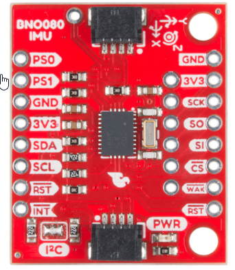
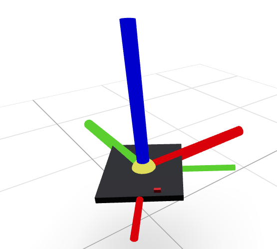

# BNO080 IMU Visualization with Viser

Real-time 3D orientation and time series visualization for BNO080 IMU data.

## Hardware

This project uses the **SparkFun BNO080 IMU** breakout board:



**Board Features:**
- BNO080 9-axis IMU with sensor fusion
- I2C interface (default address: 0x4B)
- Axis orientation marked on PCB
- Dimensions: ~2.5cm × 2.5cm PCB

## Visualization Preview



The visualization shows:
- **3D Scene** (left): IMU orientation with coordinate axes and LED indicator
- **Time Series Plots** (right): Real-time sensor data (gyro, accel, mag, linear accel, euler angles)
- **World Frame**: Blue (Z-up), Red (X-east), Green (Y-north)

## Architecture

```
┌─────────────────────────────────────────────────────────────┐
│  example_with_viewer.py (Main Loop @ 40Hz)                  │
│  ┌───────────────────────────────────────────────────────┐  │
│  │  while True:                                          │  │
│  │    data = imu.read_data()  # Read sensor              │  │
│  │    viz.update(data)        # Non-blocking update      │  │
│  │    time.sleep(1/40)        # 40Hz loop                │  │
│  └───────────────────────────────────────────────────────┘  │
└─────────────────────────────────────────────────────────────┘
                              │
                              │ viz.update(data)
                              ▼
┌─────────────────────────────────────────────────────────────┐
│  viewer.py (Viser Server - Async, Non-blocking)             │
│  ┌───────────────────────────────────────────────────────┐  │
│  │  • 3D Scene:                                          │  │
│  │    - Coordinate frame (updates with quaternion)       │  │
│  │    - Cuboid representing IMU                          │  │
│  │  • Time Series Plots (Plotly):                        │  │
│  │    - Gyroscope (3 axes)                               │  │
│  │    - Accelerometer (3 axes)                           │  │
│  │    - Magnetometer (3 axes)                            │  │
│  │    - Linear Acceleration (3 axes)                     │  │
│  │    - Euler Angles (roll, pitch, yaw)                  │  │
│  └───────────────────────────────────────────────────────┘  │
└─────────────────────────────────────────────────────────────┘
                              │
                              │ Web Interface
                              ▼
                    http://localhost:8080
```

## Installation

### Install uv (if not already installed)

```bash
curl -LsSf https://astral.sh/uv/install.sh | sh
```

### Install Python dependencies

```bash
# Install viser
uv pip install viser

# Install plotly (for time series plots)
uv pip install plotly
```

## Usage

### Simple Integration

```python
from bare import BNO080Reader
from viewer import IMUViewer
import time

# Initialize IMU
imu = BNO080Reader()

# Initialize viewer (starts web server)
viz = IMUViewer(port=8080, buffer_size=200)

# Main loop
while True:
    data = imu.read_data()

    # Update orientation only
    viz.update(data)

    # Or update both orientation and position
    # position = (x, y, z)  # Your position estimate
    # viz.update(data, position=position)

    time.sleep(1/40)  # 40Hz
```

### Run the Example

```bash
python3 example_with_viewer.py
```

Then open http://localhost:8080 in your browser.

## API Reference

### IMUViewer

```python
class IMUViewer:
    def __init__(self, port=8080, buffer_size=200):
        """
        Initialize Viser-based IMU visualizer.

        Args:
            port: Web server port (default 8080)
            buffer_size: Number of data points to display
                        (default 200 = 5s at 40Hz)
        """

    def update(self, data, position=None):
        """
        Update visualization with new IMU data.
        Non-blocking, async update.

        Args:
            data: Dictionary from BNO080Reader.read_data()
            position: Optional tuple (x, y, z) for IMU position in world frame
        """
```

### World Frame Convention

The visualization uses the **Android sensor coordinate system (East-North-Up)**:
- **X axis (Red)**: East - tangent to ground
- **Y axis (Green)**: North - magnetic north, tangent to ground
- **Z axis (Blue)**: Up - perpendicular to ground, points toward sky

The IMU cuboid dimensions:
- Length (X): 3cm (0.03m)
- Width (Y): 2.5cm (0.025m)
- Height (Z): 2mm (0.002m)
- Color: Black

LED indicator:
- Dimensions: 1mm (X) × 2mm (Y) × 1mm (Z)
- Offset from IMU center: X=1.3cm, Y=0.5cm
- Positioned on top surface
- Color: Dark red

Coordinate frame axes:
- IMU frame: 3cm axes (1× IMU length)
- World frame: 4.5cm axes (1.5× IMU length)

Ground plane:
- Size: 30cm × 30cm
- Grid cells: 5cm × 5cm
- Position: 2cm below origin

```
Top view of IMU (3cm × 2.5cm):
         Y (width, 2.5cm)
         ↑
         │
    ┌────┼────────┐
    │    │     🔴 │  ← LED (1mm × 2mm) at offset (1.3cm, 0.5cm)
    │    │        │
────┼────●────────┼──→ X (length, 3cm)
    │    │        │     ● = origin (center)
    │    │        │
    └─────────────┘

Side view (showing thin profile):
         Z (height, 2mm)
         ↑
         │ 🔴 ← LED (1mm tall) on top surface
    ─────┬──────── ← Dark red IMU board (very thin, 2mm)
         │
─────────┴────────→ X
```

## Features

### 3D Visualization
- ✅ Real-time coordinate frame showing IMU orientation (quaternion-based)
- ✅ Black cuboid representing the physical sensor (3cm × 2.5cm × 2mm)
- ✅ Dark red LED indicator on top surface (1mm × 2mm × 1mm)
- ✅ World frame with East-North-Up convention
- ✅ Properly scaled axes proportional to IMU size
- ✅ Ground plane for reference (30cm × 30cm with 5cm grid)
- ✅ Updates position and orientation at data rate (40Hz)

### Time Series Plots
- ✅ Gyroscope (rad/s) - X, Y, Z
- ✅ Accelerometer (m/s²) - X, Y, Z
- ✅ Magnetometer (µT) - X, Y, Z
- ✅ Linear Acceleration (m/s²) - X, Y, Z
- ✅ Euler Angles (degrees) - Roll, Pitch, Yaw
- ✅ Rolling window display (configurable buffer)
- ✅ Updates at 10Hz (downsampled from 40Hz for performance)

### Performance Optimizations
- Plot updates downsampled to 10Hz (every 4 samples)
- Viser's async web architecture prevents blocking
- Data collection loop maintains consistent 40Hz

## File Structure

```
bno/
├── bare.py                 # BNO080 sensor reader
├── viewer.py               # Viser visualization
├── example_with_viewer.py  # Integration example
├── README.md              # This file
├── CHANGELOG.md           # Update history
└── assets/
    ├── bno_board.png      # Hardware photo
    └── bno_viser.png      # Visualization screenshot
```

## Browser Access

### Local Access
```
http://localhost:8080
```

### Remote Access (from another computer on same network)
```
http://raspberrypi.local:8080
# or
http://<raspberry-pi-ip>:8080
```

## Troubleshooting

### Port already in use
```python
viz = IMUViewer(port=8081)  # Use different port
```

### Plots not updating
- Check browser console for errors
- Ensure plotly is installed: `uv pip install plotly`

### IMU cuboid not rotating
- Ensure you're using viser >= 0.2.10
- The code creates new numpy arrays for each update to trigger client sync

## Coordinate System Reference

### World Frame (East-North-Up)
```
      Z (Up)
      ↑
      │
      │
      └────→ Y (North)
     ╱
    ╱
   X (East)
```

### Quaternion
The rotation vector quaternion represents the rotation from the World Frame to the Sensor Frame.

```
Sensor Frame = Quaternion * World Frame
```

Reference: [Android Motion Sensors](https://developer.android.com/develop/sensors-and-location/sensors/sensors_motion)

### Euler Angles (ZYX Convention)
- **Roll**: Rotation around X-axis (East)
- **Pitch**: Rotation around Y-axis (North)
- **Yaw**: Rotation around Z-axis (Up)

## References

- [Viser Documentation](https://viser.studio/main/)
- [Viser GitHub](https://github.com/nerfstudio-project/viser)
- [Adafruit BNO08x Library](https://docs.circuitpython.org/projects/bno08x/en/latest/)
- [Android Motion Sensors](https://developer.android.com/develop/sensors-and-location/sensors/sensors_motion)
